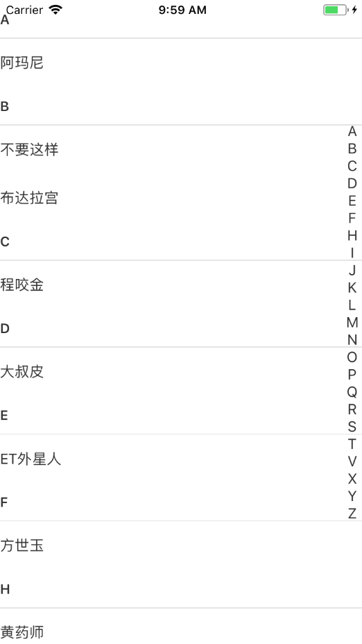

# react-native-sectionlist-contacts
Address Book library for React Native

Installation
=========
install the npm package:

    npm install react-native-sectionlist-contacts --save

Basic usage
=========
    import SectionListContacts from 'react-native-sectionlist-contacts'

    export default class Example extends React.Component {
    
     constructor(props) {
          super(props)

          //name字段必须,其他可有可无
        let nameData=[
            {name:'阿玛尼',id:'amani',params: ''},
            {name:'OK',id:'ok',params: '123'},
            {name:'天津饭'},
            {name:'%……&'},
            {name:'周星驰'},
            {name:'习大表哥'},
            {name:'不要这样'},
            {name:'V字仇杀队'},
            {name:'拼车'},
            {name:'他妈跌'},
            {name:'淫僧'},
            {name:'钱学森'},
            {name:'宁采臣'},
            {name:'史泰龙'},
            {name:'恐龙'},
            {name:'任达华'},
            {name:'妈咪宝贝'},
            {name:'ing'},
            {name:'康麦隆'},
            {name:'刘德华'},
            {name:'精忠报国'},
            {name:'黄药师'},
            {name:'大叔皮'},
            {name:'布达拉宫'},
            {name:'方世玉'},
            {name:'ET外星人'},
            {name:'程咬金'},
            {name:'**&&&&'},
        ]
        
          this.state = {
              dataArray: nameData,
          }
      }

      render() {
            return(
                <View style={styles.container}>
                    <SectionListContacts
                        ref={s=>this.sectionList=s}
                        sectionListData={this.state.dataArray}
                        sectionHeight={50}
                        initialNumToRender={this.state.dataArray.length}
                        showsVerticalScrollIndicator={false}
                        SectionListClickCallback={(item,index)=>{
                           console.log('---SectionListClickCallback--:',item,index)
                        }}
                        otherAlphabet="#"
                    />
                </View>
            )
        }
    }
Props
=========

* **sectionListData** (Array) required- data to display
* **sectionHeight** (Integer) optional- height of the section item
* **initialNumToRender** (Integer) optional- initial num of item to render
* **showAlphabet** (Bool)optional - When false, Alphabet will not be displayed , default is true
* **SectionListClickCallback** (Function(item, index)) optional- Callback when each item is pressed
* **sectionHeaderTextStyle** (Text.propTypes.style) optional- style of the section header text 
* **sectionItemViewStyle** (View.propTypes.style) optional- style of the section item View 
* **sectionItemTextStyle** (Text.propTypes.style) optional- style of the section item text
* **letterViewStyle** (View.propTypes.style) optional- style of right alphabet view
* **letterTextStyle** (Text.propTypes.style) optional- style of right alphabet text
* **renderHeader**(Function:ReactComponent) optional-  Custom header component, accept 1 argument props and should return a component to use as the header.
* **renderItem** (Function:ReactComponent) optional- Custom section item component,accept 2 argument props and should return a component to use as the ssction item.
* **otherAlphabet** (String) optional- the other alphabet

Advanced Usage
=========

If you want to custom header,you can do like this:

    render(){
         <SectionListContacts
            ...
            renderHeader={this._renderHeader}
        />
    }
    
    _renderHeader=(params)=>{
        console.log('---custom-renderHeader--',params)
        return <View><Text>{params.key}</Text></View>
    }
    
If you want to custom section item,you can do like this:

    render(){
         <SectionListContacts
            ...
           renderItem={this._renderItem}
        />
    }

    renderItem=(params)=>{
        console.log('---custom-renderItem--',params)
        return <View><Text>{params.name}</Text></View>
    }
    
Contribution
=========

Issues and contributions are very welcome: bug fixes, features, documentation.

